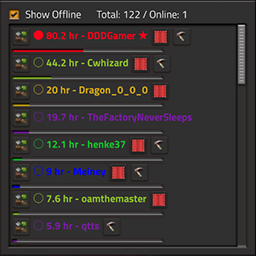
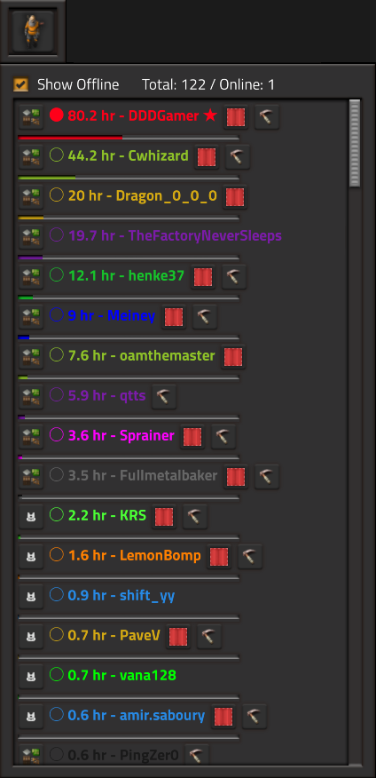

# DDDGamer's [Factorio](https://www.factorio.com/) Player List Mod 

Shows a list of players in the game (more useful in multiplayer games, but works in single player as well)

Also take a look at my [softmod pack](https://github.com/deniszholob/factorio-softmod-pack) that uses this mod

# Installation
1. In Game Install
   * Search for the mod in the `Mods` menu and Factorio will install it and restart automatically
2. Mod Portal/Manual install
   * Download the zipped file `ddd-player-list_x.x.x.zip`
     * From the [Mod Portal](https://mods.factorio.com/https://mods.factorio.com/mod/ddd-player-list)
     * OR the [Latest Release](https://github.com/deniszholob/factorio-softmod-pack/releases/latest)
   * Place into the `%appdata%/Factorio/mods` directory, see [wiki for more details](https://wiki.factorio.com/Modding#Downloading_.26_installing_mods)

# Support Me
If you find the cheat sheet or the source code useful, consider:

* Donating Ko-fi: https://ko-fi.com/deniszholob
* Supporting on Patreon: https://www.patreon.com/deniszholob

# Screenshots

